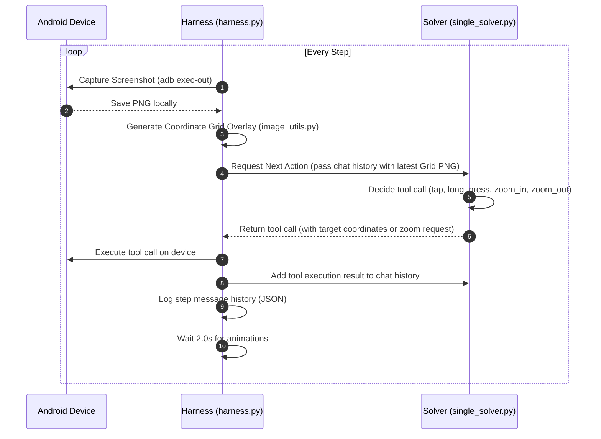

# Android Minesweeper LLM Benchmark Harness

This benchmark harness evaluates a Large Language Model's capability to play Minesweeper on an Android device (physical or emulator) using a unified, single-model architecture.

The system leverages:

1. **Gemini 3.1 Pro (via OpenAI-compatible API)** as an autonomous agent playing Minesweeper using tool calling (tap, long_press, zoom_in, zoom_out) without any hardcoded logic or coordinate assumptions.
2. **Pillow** to pre-process screenshots, drawing a coordinate grid over them to eliminate LLM coordinate hallucinations.
3. **ADB (Android Debug Bridge)** and **`uiautomator2`** to interact with the device.

---

## Architectural Flow

The harness coordinates a closed-loop system where the state of the Android application is captured, processed, and analyzed directly by a single vision-capable LLM to make move decisions.



---

## Architecture and Components

- [harness.py](harness.py): The main loop that captures screenshots, triggers the coordinate grid generation, executes tool actions on the device, and manages the run lifecycle.
- [image_utils.py](image_utils.py): Grid overlay utility that overlays a 100px red axis grid and 200px intersection coordinate markers onto the screenshots.
- [single_solver.py](single_solver.py): Manages the message history, registers tools (tap, long_press, zoom_in, zoom_out), and requests actions from the LLM.
- [adb_device.py](adb_device.py): Wraps ADB and `uiautomator2` to handle screen captures, tap actions, long press gestures, and multi-touch zoom gestures.
- [cli_tester.py](cli_tester.py): An interactive command-line interface to manually test tool actions (taps, long presses, zooms) and generate grid screenshots on the connected device.

---

## Setup Instructions

### 1. Pre-requisites

- **Python 3.10+**: Ensure Python is installed.
- **ADB (Android Debug Bridge)**: Must be installed and available in your system `PATH`. Verify this by running:
    ```powershell
    adb devices
    ```
- **Android Device or Emulator**:
    - If using a physical phone, enable **USB Debugging** in Developer Options.
    - If using an emulator, start it from Android Studio or the command line.

### 2. Install Python Dependencies

Install the required packages in your python environment:

```powershell
pip install -r requirements.txt
```

_(Note: `uiautomator2` is a hard requirement for the harness to run.)_

### 3. Configuration

Copy the `.env.example` file to `.env`:

```powershell
cp .env.example .env
```

Fill in the following details in `.env`:

- `VISION_API_KEY`: Your Gemini/Google API Key.
- `VISION_BASE_URL`: OpenAI-compatible endpoint URL for Gemini (e.g. `https://generativelanguage.googleapis.com/v1beta/openai/`).
- `VISION_MODEL`: The model name (e.g. `gemini-3.1-pro-preview` or your specific version).
- `ADB_DEVICE_SERIAL`: (Optional) If you have multiple devices connected, specify the target serial here (found via `adb devices`).

---

## How to Play / Run the Benchmark

1. Make sure your Android device is connected and displaying the Minesweeper game screen.
2. Run the harness:
    ```powershell
    python harness.py
    ```
3. The harness will automatically:
    - Identify your connected device.
    - Start a benchmark run under `runs/run_<timestamp>/`.
    - Take screenshots at each step and overlay the coordinate grid.
    - Call the Solver LLM, which uses direct tool calls (`tap`, `long_press`, `zoom_in`, `zoom_out`) to play the game.
    - Prune past screenshot images dynamically to keep context optimized and avoid API rate limits.

### Manual Tool Testing CLI

You can manually test tool calls and inspect coordinate grid overlays using the interactive CLI tester:
1. Run the CLI:
   ```powershell
   python cli_tester.py
   ```
2. The CLI will autoconnect to your device and take an initial grid-overlaid screenshot at `runs/cli_test/cli_step_0.png`.
3. Enter interactive commands (such as `tap 500 1200`, `long_press 300 500`, `zoom_in`, `zoom_out`, or `screenshot`) to perform actions on the screen.
4. After each action, the CLI will capture a new screenshot, apply the coordinate grid overlay, and save it to the `runs/cli_test/` directory, printing the file path so you can verify coordinates and game response.

---

## Benchmarking Logs

Each run creates a dedicated folder under `runs/run_<timestamp>/` containing:

- `step_{N}_screenshot.png`: The raw device screen.
- `step_{N}_screenshot_grid.png`: The screenshot with the coordinate grid overlay analyzed by the LLM.
- `step_{N}_messages.json`: The complete chat messages history at that step, including system prompt, assistant tool calls, tool results, and the latest screenshot.
